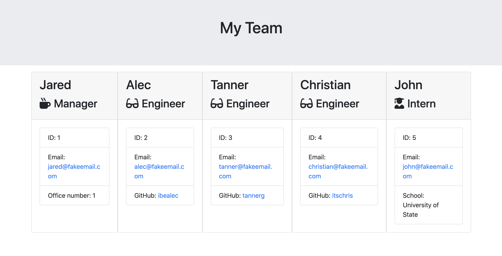

# TeamGenerator

## TABLE OF CONTENTS
* [Description](#description)
* [Usage](#usage)
* [Examples](#examples)
* [Questions](#questions)

## Description
Quickly and easily manage your employees using this command line application. This app will generate an easy-to-read html page using your input from a series of prompts, that will allow you to grab basic employee info at a glance. 

## Usage
To use this app, you first need to install the dependencies by running `npm install` in the command line. Once installation is complete, simply run `node app.js` in your terminal and answer the series of prompts that follow. Once you have entered information for all of your team members, select "Quit" to write the info to an html file (this will be written to the /output directory). Now just open the file in your browser and access the info you need at any time. 

## Examples:
Below is an example of a webpage generated using this application:

## Questions?
Please direct all questions to cseibert2667@gmail.com, and be sure to check out my other projects at [cseibert2667](https://www.github.com/cseibert2667).